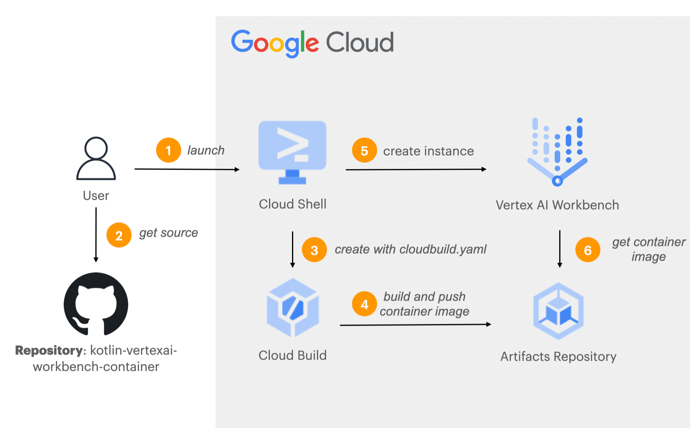
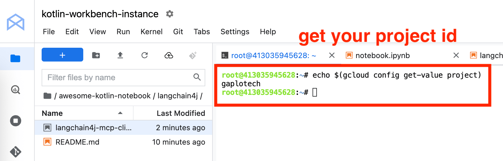
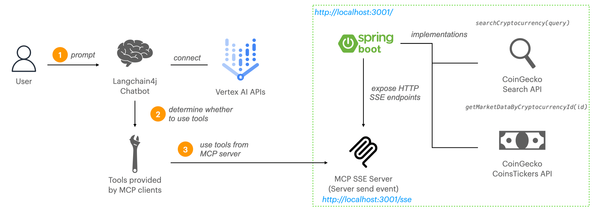
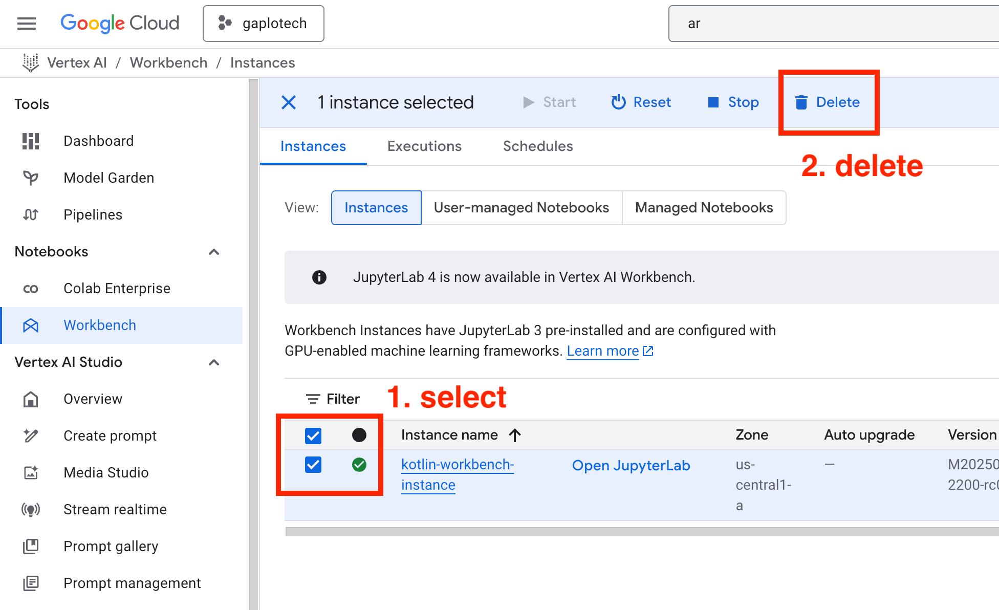

# Kotlin Jupyter Kernel with Vertex AI Workbench

This container can be used as a custom container for Google Cloud Vertex AI Workbench instances.

The architecture to build a Vertex AI workbench container image.

<p align="center" width="100%">

</p>

## Lab 0: Create Vertex AI Workbench

### Step 1: Select the project and open Google Cloud Shell

Login to [Google Cloud Platform](https://console.cloud.google.com/vertex-ai/workbench/instances).
Select the right project and click to open the Google Cloud Shell as shown below. 

<p align="center" width="100%">

</p>

### Step 2: Create Kotlin Jupyter Vertex AI Workbench (takes 10 minutes)

Accept and authorize to use Google Cloud Shell. Copy and paste the following scripts. The script will do the following:

2.1 Enable all the services in Google Cloud

2.2 Create [Artifacts Repository](https://cloud.google.com/artifact-registry/docs/overview) for Kotlin Jupyter container image.

2.3 Create serverless [Cloud Build](https://cloud.google.com/build?hl=en) to build the image from this repository's `Dockerfile`. 
See the [cloudbuild.yaml](cloudbuild.yaml) configuration.

2.4 Create Vertex AI workbench instance

<p align="center" width="100%">

</p>

```bash
# clone the repository
echo "[Step 2] Clone the repository..."
cd ~
git clone https://github.com/gaplo917/kotlin-vertexai-workbench-container.git || true
cd kotlin-vertexai-workbench-container
git fetch --all && git reset --hard origin/main

# enable services APIs
echo "[Step 2.1] Enable services APIs..."
gcloud services enable aiplatform.googleapis.com
gcloud services enable artifactregistry.googleapis.com
gcloud services enable cloudbuild.googleapis.com
gcloud services enable containerfilesystem.googleapis.com
gcloud services enable containerregistry.googleapis.com


PROJECT_ID=$(gcloud config get-value project)

# create artifacts repository
echo "[Step 2.2] Create artifacts repository..."
gcloud artifacts repositories create demo --repository-format=docker --location=us --project=$PROJECT_ID || true

# create build to push image to repository
echo "[Step 2.3] create build to push image to repository..."
gcloud builds submit --config cloudbuild.yaml

# create Vertex AI workbench instance
echo "[Step 2.4] create Vertex AI workbench instance..."
gcloud workbench instances create kotlin-workbench-instance \
  --metadata=idle-timeout-seconds=10800 \
  --location=us-central1-a \
  --container-repository=us-docker.pkg.dev/$PROJECT_ID/demo/kotlin-vertexai-workbench-container \
  --container-tag=latest \
  --machine-type=e2-standard-4 \
  --project=$PROJECT_ID
  
echo "[Completed] You can go to https://console.cloud.google.com/vertex-ai/workbench/instances"
```

### Step 3: Go to Vertex AI workbench

https://console.cloud.google.com/vertex-ai/workbench/instances 


## Lab 1: Run Kotlin Jupyter Notebook for Gemini

### Step 1: Open Jupyter Lab > Terminal

<p align="center" width="100%">

</p>

<p align="center" width="100%">

</p>

### Step 2: Clone the repository 

- Type `git clone https://github.com/gaplo917/awesome-kotlin-notebook/` for Lab 1, 3
- Type `git clone https://github.com/gaplo917/kotlin-cyrpto-price-spring-mcp-server-demo` for Lab 3

<p align="center" width="100%">
    
</p>

### Step 3: Get your Project ID

Type `echo $(gcloud config get-value project)` to get your project ID

<p align="center" width="100%">
    
</p>

### Step 4: Open the Kotlin Jupyter Notebook

Navigate `awesome-kotlin-notebook/google-genai-sdk/` in the file browser. Open `vertexai-gemini-examples.ipynb`.

<p align="center" width="100%">

</p>

### Step 5: Run the Kotlin Notebook

Remember to replace your project ID in one of the cells

## Lab 2: Run Spring Boot MCP Server

* Navigate `kotlin-cyrpto-price-spring-mcp-server-demo/` in the file browser
* Open `notebook.ipynb`
* Start Spring Boot MCP Server and proceed to Lab 3

<p align="center" width="100%">

</p>

The MCP Architecture

<p align="center" width="100%">

</p>


## Lab 3: Run Kotlin Jupyter Notebook for Langchain4j MCP Client

Follow up on Lab 1:

* Navigate `awesome-kotlin-notebook/langchain4j/` in the file browser
* Open `langchain4j-mcp-client-vertexai.ipynb`
* Run the Kotlin Notebook, remember to replace your project ID in one of the cells


## Completed all labs

Congratulation! You have completed all the labs! Remember to delete Vertex AI instance to avoid unnecessary charges.

<p align="center" width="100%">

</p>
