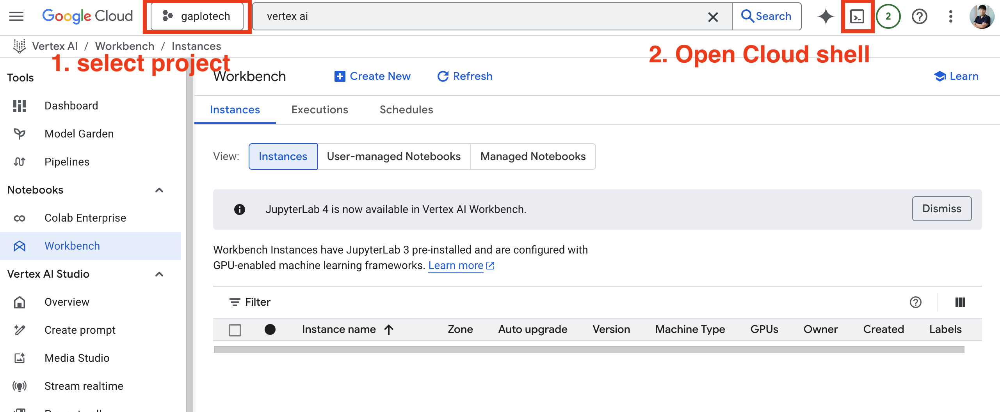
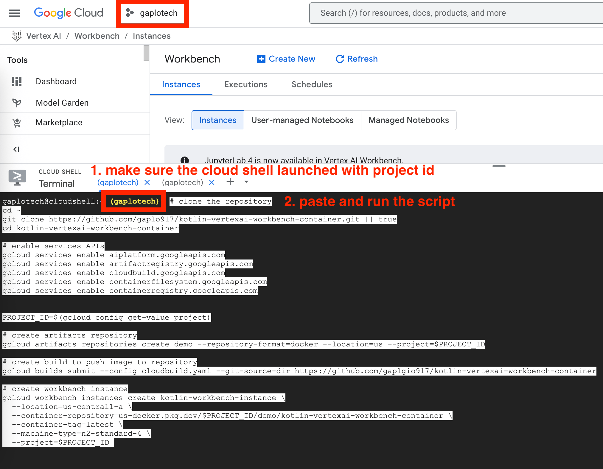
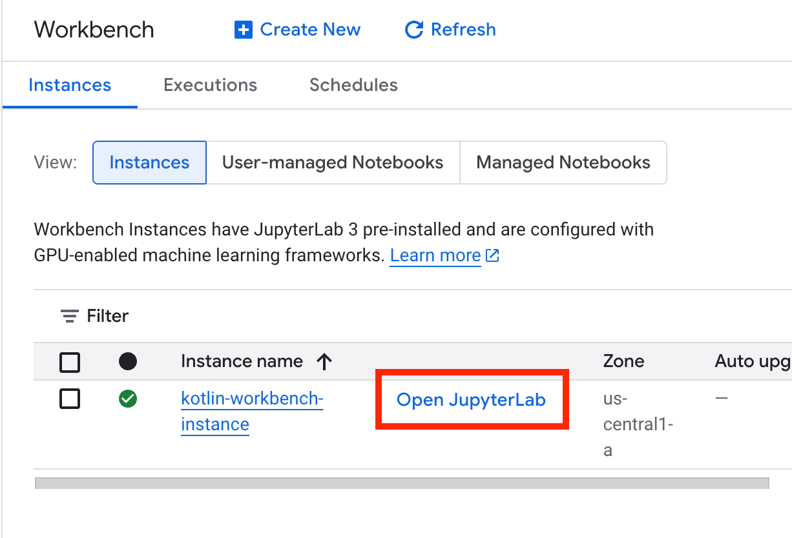
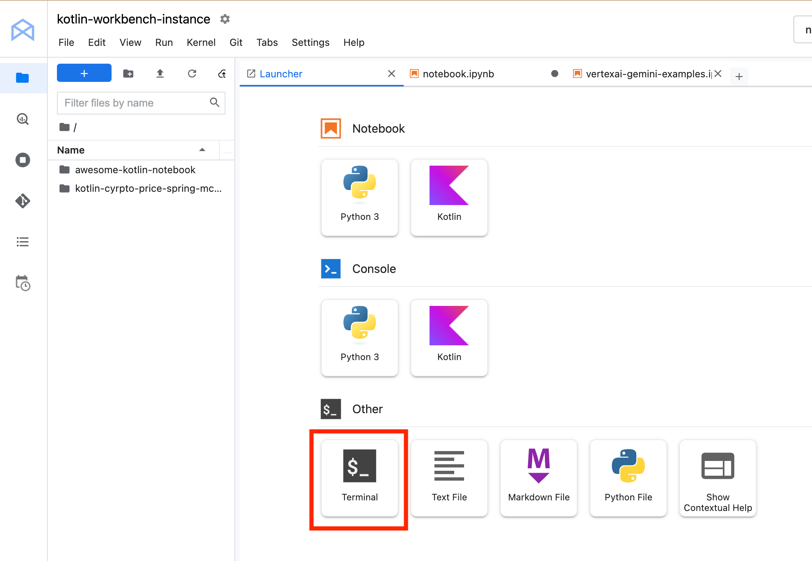
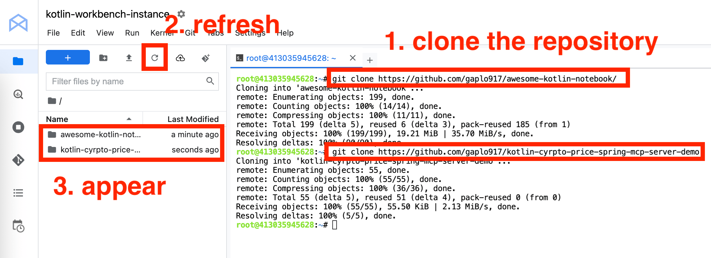
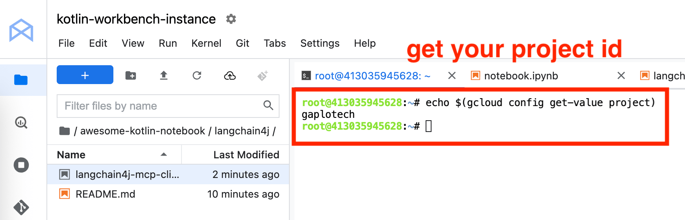
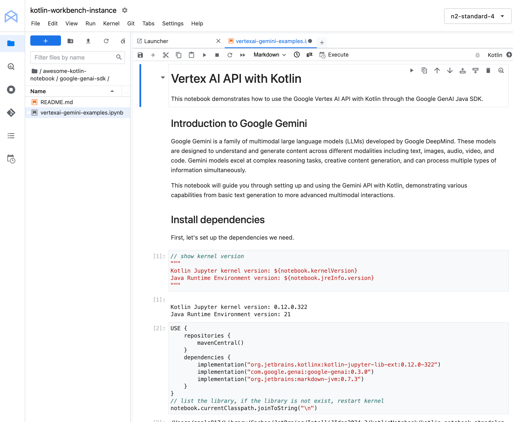
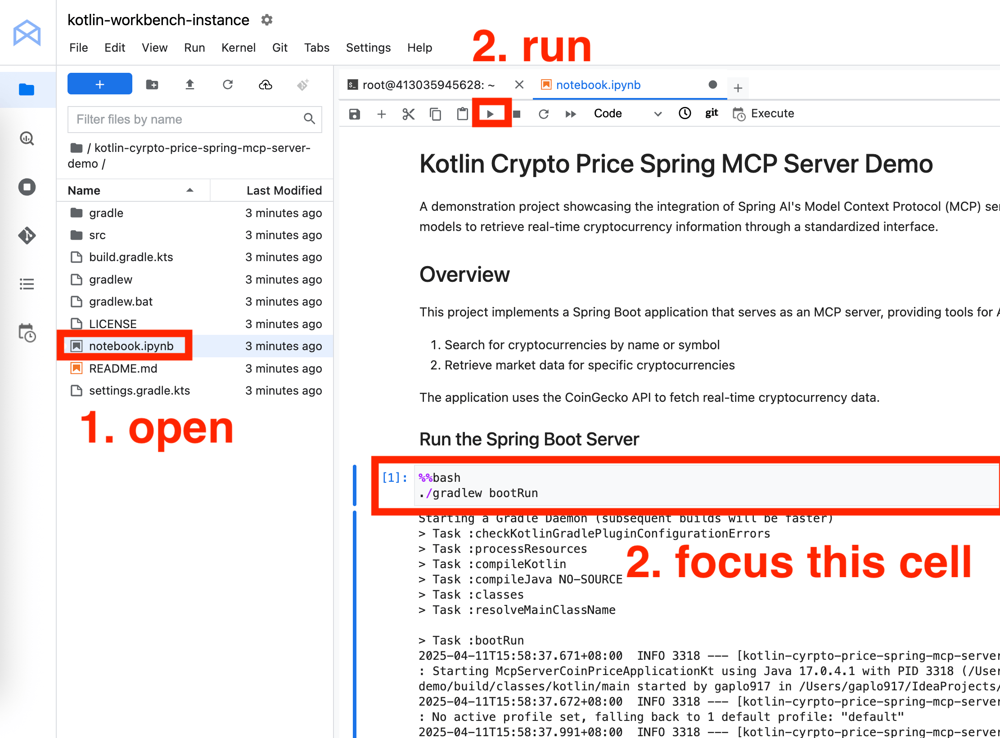

## Using with VertexAI Workbench

This container can be used as a custom container for Google Cloud VertexAI Workbench instances.

#### Step 1: Select the project and open Google Cloud Shell

Login [Google Cloud Platform](https://console.cloud.google.com/vertex-ai/workbench/instances).
Select the right project and click to open the Google Cloud Shell as shown below. 




#### Step 2: Create Kotlin Jupyter Vertex AI Workbench (takes 10 minutes)

Accept and authorize to use Google Cloud Shell. Copy and paste the follow scripts. The script will do the followings

2.1 Enable all the services in Google Cloud

2.2 Create [Artifacts Repository](https://cloud.google.com/artifact-registry/docs/overview) for Kotlin Jupyter container image.

2.3 Create serverless [Cloud build](https://cloud.google.com/build?hl=en) to build the image from this repository `Dockerfile`. 
See the [cloudbuild.yaml](cloudbuild.yaml) configuration.

2.4 Create Vertex AI workbench instance

```bash
# clone the repository
cd ~
git clone https://github.com/gaplo917/kotlin-vertexai-workbench-container.git || true
cd kotlin-vertexai-workbench-container

# enable services APIs
gcloud services enable aiplatform.googleapis.com
gcloud services enable artifactregistry.googleapis.com
gcloud services enable cloudbuild.googleapis.com
gcloud services enable containerfilesystem.googleapis.com
gcloud services enable containerregistry.googleapis.com


PROJECT_ID=$(gcloud config get-value project)

# create artifacts repository
gcloud artifacts repositories create demo --repository-format=docker --location=us --project=$PROJECT_ID || true

# create build to push image to repository
gcloud builds submit --config cloudbuild.yaml --git-source-dir https://github.com/gaplgio917/kotlin-vertexai-workbench-container

# create workbench instance
gcloud workbench instances create kotlin-workbench-instance \
  --location=us-central1-a \
  --container-repository=us-docker.pkg.dev/$PROJECT_ID/demo/kotlin-vertexai-workbench-container \
  --container-tag=latest \
  --machine-type=n2-standard-4 \
  --project=$PROJECT_ID
````



#### Step 3: Go to Vertex AI workbench

https://console.cloud.google.com/vertex-ai/workbench/instances 


#### Lab 1: Run Kotlin Jupyter Notebook for Gemini

Step 1: Open Jupyter Lab > Terminal





Step 2: 
- Type `git clone https://github.com/gaplo917/awesome-kotlin-notebook/` for Lab 1, 3
- Type `git clone https://github.com/gaplo917/kotlin-cyrpto-price-spring-mcp-server-demo` for Lab 3



Step 3: Type `echo $(gcloud config get-value project)` to get your project ID



Step 4: Navigate awesome-kotlin-notebook in the file browser, open `google-genai-sdk/vertexai-gemini-examples.ipynb`



Step 5: Run the Kotlin Notebook, remember to replace your project ID in one of the cell

#### Lab 2: Run Spring Boot MCP Server

* Navigate `kotlin-cyrpto-price-spring-mcp-server-demo` in the file browser
* Open `notebook.ipynb`
* Start Spring Boot MCP Server and proceed to Lab 3



#### Lab 3: Run Kotlin Jupyter Notebook for Langchain4j MCP Client

Follow up on Lab 1:

* Navigate `awesome-kotlin-notebook` in the file browser
* Open `langchain4j/langchain4j-mcp-client-vertexai.ipynb`
* Run the Kotlin Notebook, remember to replace your project ID in one of the cell

